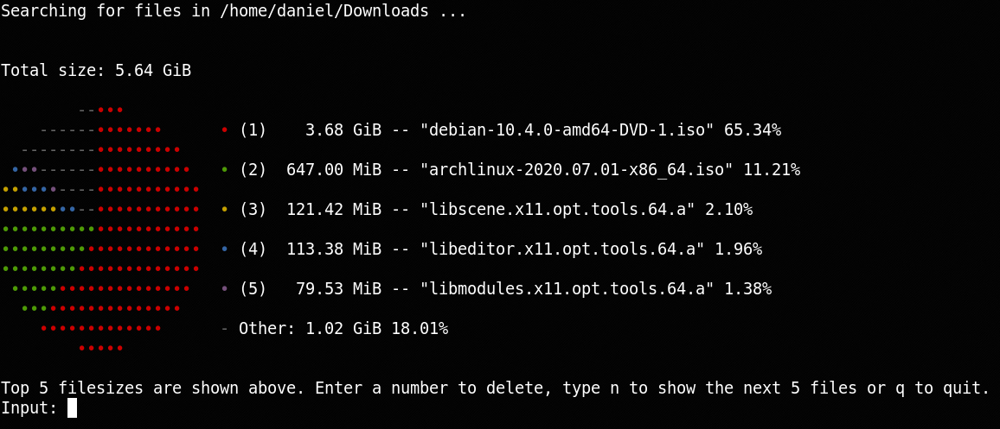

# piecut
Get a clear and beautiful representation of the files that take up most of your space. Delete them interactively and move on to the next pie.

There are also various options to only include files with a certain age.

## Downloads

Binaries for Linux and Windows are available [here](https://github.com/gonsor/piecut/releases/).